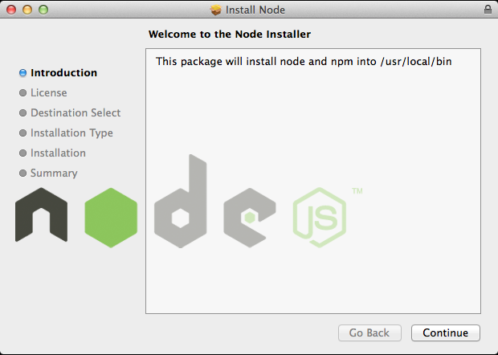
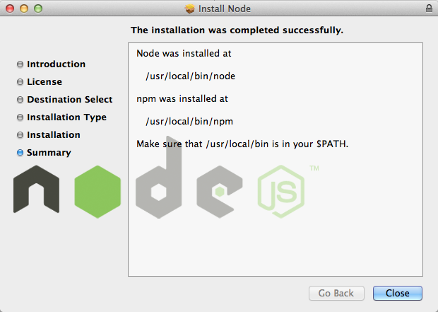

#Installing Node.js® and NPM

## What's Node.js®  and NPM?
Node.js® is a JavaScript-based environment which you can use to create web-servers and networked applications. You can also use it to perform helpfule tasks on your computer such as concatentating and minifying JavaScript files and compiling Sass files into CSS.

NPM is a "package manager" that makes it easy to install Node "packages." A package is just a code library that extends Node by adding useful features. For example, the "request" package simplifies the process of making HTTP so you can easily request web resources from other sites.

NPM is installed when you install Node.js®

## Prerequisites
* You should have some familiarity with the Mac Terminal, since you'll need to use it to finish configuring the installation and test it. You'll also need the Terminal to use Node.js and NPM.
* Ability to add software to your computer -- that means you'll need to have an administrator username and password for your machine.

## Installation Overview
Installing Node.js® and NPM is pretty straightforward on the Mac. You just need to download the installer, run it, and make sure you've set up your computer so it can find the Node program. 

## Installation Steps
1. **Download the installer from [http://nodejs.org/download/](http://nodejs.org/download/).** Make sure you download the .pkg (package) version -- the binary versions are more complicated to set up.

2. **Open and run the package.** Just double click the .pkg file to run it. 
  * Click Continue
    

  * Accept license
  * Click install
  * Type admin password
  * Complete
   

* Add /usr/local/bin to $PATH
  * Open terminal
  * Check: echo $PATH
  * Add if not there
    * export PATH=$PATH:/usr/local/bin/
    * source $HOME/.bash_profile
    
## Test it!