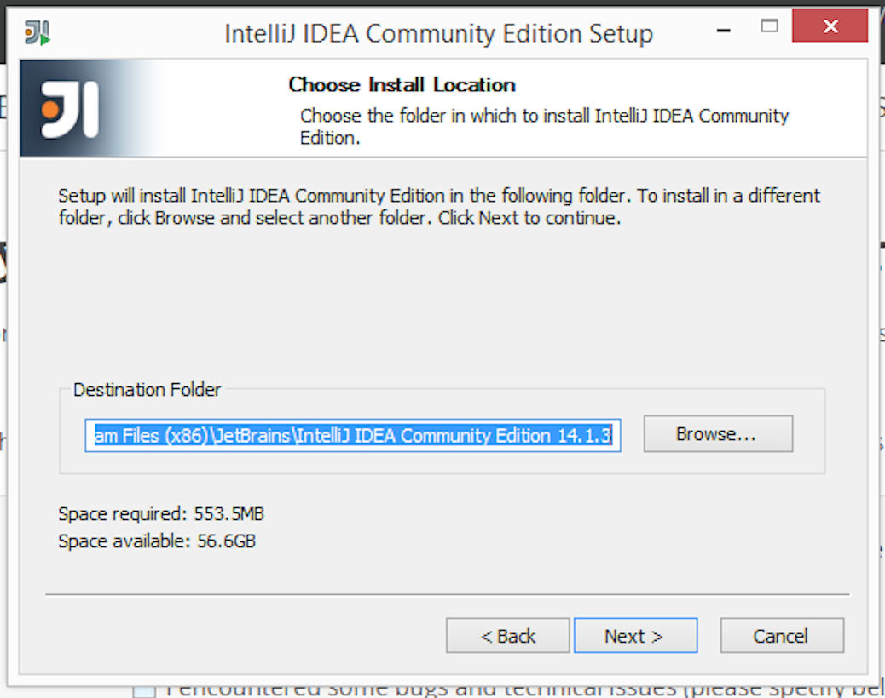
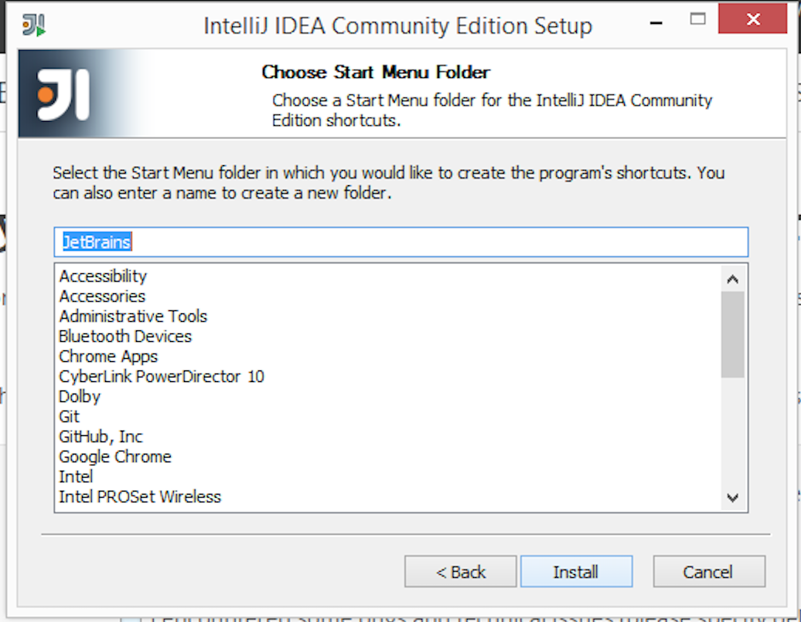
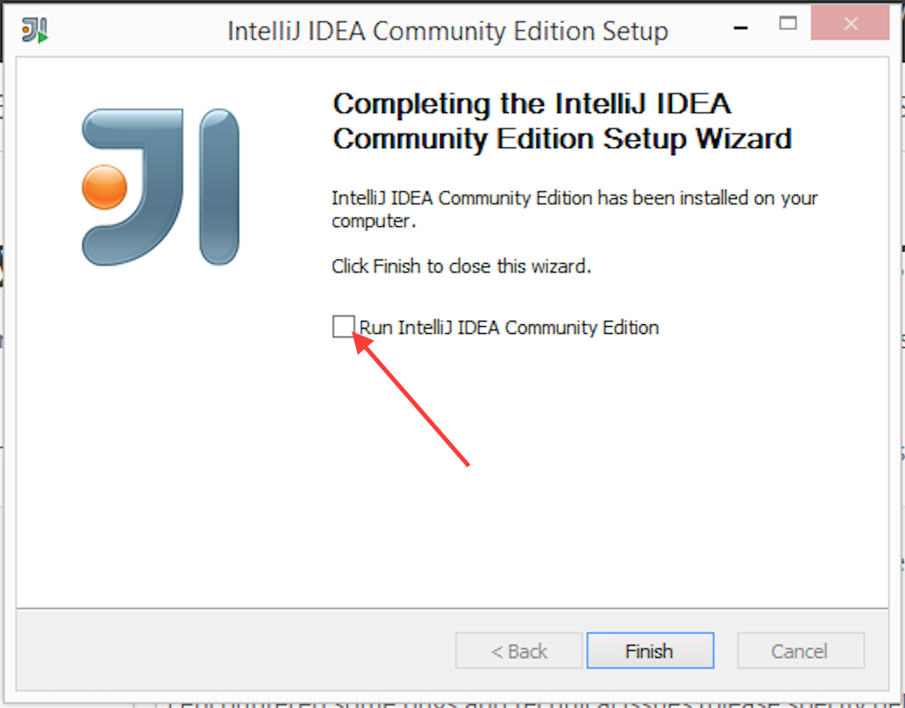
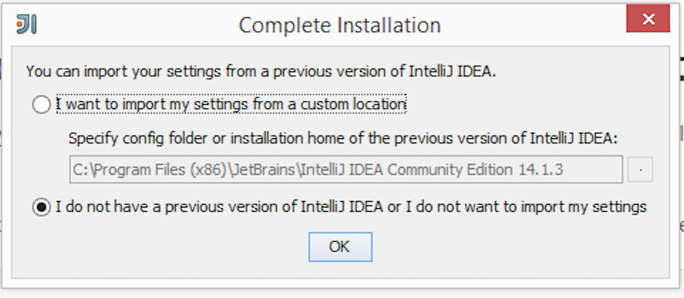
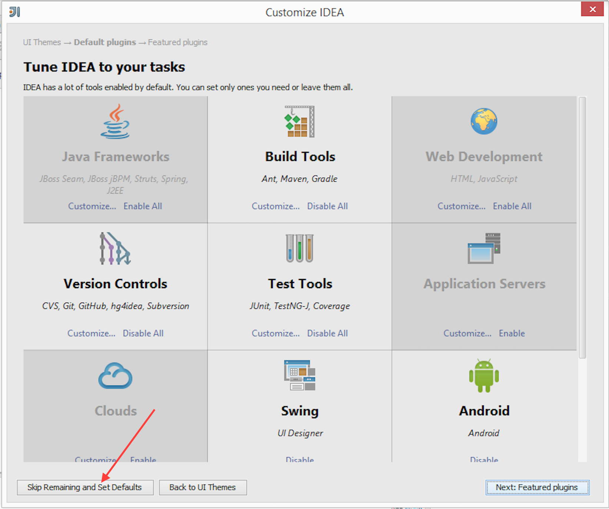

## What is a IntelliJ IDEA?
IntelliJ IDEA is an IDE, or Integrated Development Environment, by JetBrains. It attempts to integrate all of the development tools that you might need into one single place.

There is a Community Edition that is available for a [free download](https://www.jetbrains.com/idea/download/)

## Installation
1. Choose the Windows tab (probably defaulted) and click the "Download Community" link

2. Open the .exe and choose next
* 

3. Choose default install location and menu
* 
* 

4. Choose to associate .java files (unless you don't want to, this will make a double click of a .java file open in IDEA)
* 

5. Choose the run checkbox, so we can finish installation
* 

6. Leave the default chosen for importing (again unless you do have files)
* 

7. Choose "Skip Remaining and Set Defaults"
* 

8. Finally if you get warned about Firewall access. Choose allow (unless you are feeling paranoid).
* 

## Known installation issues
There are currently no reported issues.  If you are having one, please report it in the [Treehouse forum](http://teamtreehouse.com/forum/topic:java).