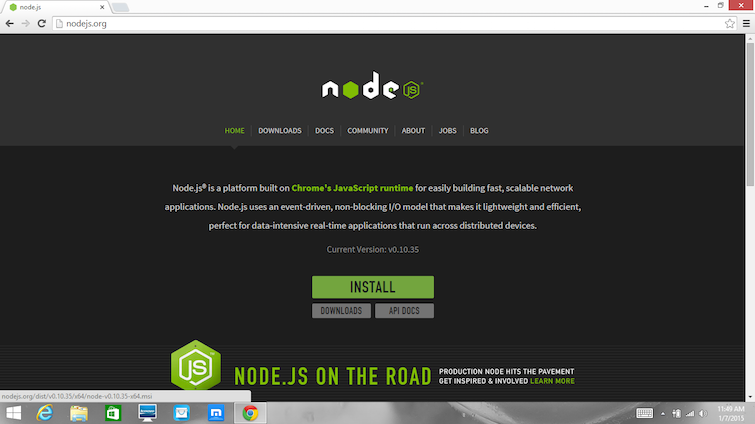

## What's Node.js®  and NPM?
Node.js® is a JavaScript-based environment which you can use to create web-servers and networked applications. You can also use it to perform helpful tasks on your computer such as concatenating and minifying JavaScript files and compiling Sass files into CSS.

NPM is a "package manager" that makes installing Node "packages" fast and easy. A package is just a code library that extends Node by adding useful features. For example, the "request" package simplifies the process of making HTTP requests so you can easily get web resources from other sites.

NPM is installed when you install Node.js®

## Prerequisites
* **You should have some familiarity with an application that lets you issue command line instructions.** For example, the Windows Command Prompt, PowerShell, [Cygwin](https://www.cygwin.com/), or the Git shell (which you get when you install [Github for Windows](https://windows.github.com/)). 

## Installation Overview
Installing Node.js® and NPM is pretty straightforward using the installer package avaialble from the Node.js web site.

## Installation Steps

1. **Download the Windows installer from [Nodejs.org](http://nodejs.org/download/).** 
2. **Run the installer** (the .msi file you downloaded in the previous step.)
3. **Follow the prompts in the installer** (Accept the license agreement, click the NEXT button a bunch of times and accept the default installation settings).   
4. **Restart your computer.** You won't be able to run Node.js until you restart your computer.
 

## Test it!
Make sure you have Node and NPM installed by running simple commands to see what version of each is installed:

* **Test Node.** To see if Node is installed, open the Windows Command Prompt, Powershell or a similar command line tool, and type `node -v`. This should print the version number so you'll see something like this `v0.10.35`.
* **Test NPM.** To see if NPM is installed, type `npm -v` in Terminal. This should print the version number so you'll see something like this `1.4.28`
* **Create a test file and run it.** A simple way to test that node.js works is to create a simple JavaScript file: name it hello.js, and just add the code `console.log('Node is installed!');`. To run the code simply open your command line program, navigate to the folder where you save the file and type `node hello.js`. This will start Node.js and run the code in the `hello.js` file. You should see the output `Node is installed!`.

## How to Update Node and NPM
New versions of Node and NPM come out frequently. To install the updates, just [download the installer](http://nodejs.org/download/) from the Nodejs.org site and run it again. The new version of Node.js and NPM will replace the older versions.

## How to Uninstall Node and NPM
You uninstall Node.js and NPM the same as you would most all Windows software:

1. Open the Windows Control Panel
2. Choose the Programs and Features option
3. Click the "Uninstall a program"
4. Select Node.js, and click the Uninstall link.

