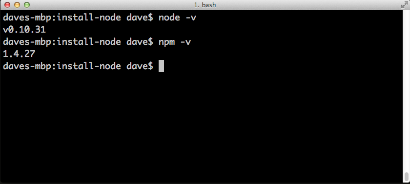

# Installing Node.js® and NPM on a Mac

## What's Node.js®  and NPM?
Node.js® is a JavaScript-based environment which you can use to create web-servers and networked applications. You can also use it to perform helpful tasks on your computer such as concatentating and minifying JavaScript files and compiling Sass files into CSS.

NPM is a "package manager" that makes installind Node "packages" fast and easy. A package is just a code library that extends Node by adding useful features. For example, the "request" package simplifies the process of making HTTP request so you can easily get web resources from other sites.

NPM is installed when you install Node.js®

## Prerequisites
* **You should have some familiarity with the Mac Terminal application** since you'll need to use it to install and test Node and NPM. You'll also need the Terminal to use Node.js and NPM. The Terminal application is located in the Utilities folder in the Applications folder.
* **Dependencies.** You need to install two other pieces of software before you can install Node. In addition, you need to install these in a specific order:
  1. **XCode.** Install Apple's XCode development software: [XCode in the Apple App Store](http://itunes.apple.com/us/app/xcode/id497799835?ls=1&mt=12). 
  2. **Homebrew**. Homebrew is a package manager for the Mac -- it makes installing most open source sofware (like Node) as simple as writing `brew install node`. You can learn more about Homebrew at the [Homebrew website](http://brew.sh/). To install Homebrew just open Terminal and type `ruby -e "$(curl -fsSL https://raw.githubusercontent.com/Homebrew/install/master/install)"`. You'll see messages in the Terminal explaining what you need to do to complete the installation process.

## Installation Overview
Installing Node.js® and NPM is pretty straightforward using Homebrew. Homebrew handles downloading, unpacking and installing Node and NPM on your system. The whole process (after you have XCode and Homebrew installed) should only take you a few minutes.

## Installation Steps
* **Open the Terminal app** and type `brew install node`.
* **Sit back and wait.** Homebrew has to download some files and install them. But that's it.
 
## Test it!
Make sure you have Node and NPM installed by running simple commands to see what version of each is installed:

* **Test Node.** To see if Node is installed, type `node -v` in Terminal. This should print the version number so you'll see something like this `v0.10.31`.
* **Test NPM.** To see if NPM is installed, type `npm -v` in Terminal. This should print the version number so you'll see something like this `1.4.27`

## How to Update Node and NPM
New versions of Node and NPM come out frequently. You can use Homebrew to update the software it installs.

1. Make sure Homebrew has the latest version of the Node package. In Terminal type 
`brew update`
2. Upgrade Node: `brew upgrade node`

## How to Uninstall Node and NPM
You can use Homebrew to uninstall packages that it installed:

`brew uninstall node`